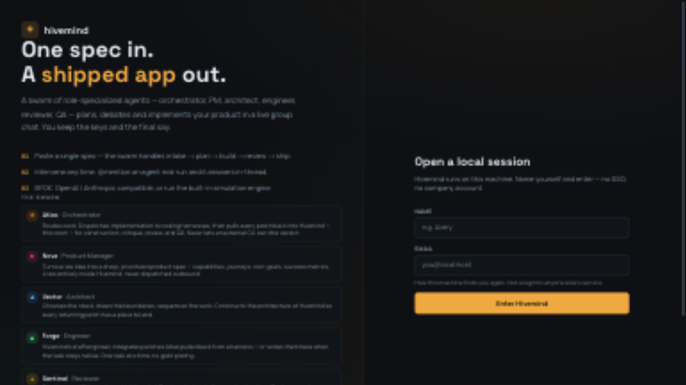

# ◈ Hivemind

**One spec in. A shipped app out.**

You paste a product spec — or import a codebase you already have — and six role-specialized agents plan, argue, implement, review, and QA the result in a live group chat. You're the **Commander**: every API key is yours, and the final say is yours.

Three commitments hold the whole thing up:

- **Live models only.** No simulation engine exists. If a model call fails, the swarm stops and tells you exactly why. It never fakes output.
- **Hivemind is home base.** Implementation can be *routed* out to coding-agent harnesses (Claude Code, Grok, Cursor, Codex, Aider, Gemini, OpenCode) — but construction, critique, review, and QA happen in this room.
- **The swarm does not self-certify.** Build starts only after your approval. Shipping over a reviewer objection takes an explicit override.

Built for one machine and one operator. Local sessions, local Postgres. No accounts. No hosted service. No team theater.



---

## The swarm

Six specialists, each addressable by `@mention` mid-run, each routable to its own provider + model:

| Agent | Glyph | Role | What it does |
|-------|-------|------|--------------|
| **Atlas** | ◈ | Orchestrator | Routes work to harnesses and collects every patch back into Hivemind. An external CLI never owns the verdict. |
| **Nova** | ✦ | Product Manager | Distills your spec into capabilities, journeys, non-goals, and success metrics. Never dispatched outbound. |
| **Vector** | ▲ | Architect | Picks the stack, draws boundaries, sequences tasks. |
| **Forge** | ⬢ | Engineer | Writes the code — native files, or integration of patches returning from harness routes. One task at a time. |
| **Sentinel** | ◆ | Reviewer | Real code review: findings with file references and P0–P3 severity, ending in a binding verdict — `APPROVED` or `CHANGES`. |
| **Probe** | ◎ | QA Engineer | Publishes the verification checklist before ship, and states plainly that review was static and nothing was executed. |

### Mission lifecycle

```
intake → spec → plan → critique → [your approval] → build → review → ship → done
```

Atlas receives the brief on intake and assembles the swarm. Nova writes the v1 spec; Vector drafts the architecture and pulls the task list out of the model. Critique is where it gets interesting: Sentinel raises design concerns, Vector absorbs them, Nova either holds the spec at v1 or publishes a v2 — and then everything stops. Nothing builds until you approve, or revise with notes.

Build runs task by task under Forge, each one showing live in the activity strip and on the task board. Harness-routed tasks print the host command and land back in the workbench. Once the code's in, Sentinel reviews the workspace; changes trigger one fix round and one re-read — not an endless loop. An objection that survives parks the mission for you. Reply **ship anyway** to override, or send notes and it reworks.

At ship, Probe publishes the QA checklist and Atlas writes the ship report. The report includes a multi-harness pack — `HARNESS.md`, `AGENTS.md`, `CLAUDE.md`, `GEMINI.md`, `CONVENTIONS.md`, `.cursor/rules/project.mdc` — so any coding agent can pick the repo up cold. Export downloads the whole mission as a verified zip.

### Live-only honesty

This rule runs deeper than the rest, so it gets said bluntly. Every model-produced message is stamped with its `provider · model`. When a call fails, the run **halts** with the exact error and points you at `doctor` — nothing fake gets written, ever. Older missions still show historical `sim` badges; that record is kept on purpose. QA is honest to a fault: the checklists say outright that review was static and nothing was executed.

---

## Quickstart

Requirements: Node 22+, npm, and either the Apple `container` CLI (preferred) or any way to run PostgreSQL 16 on `127.0.0.1:5432`.

```bash
git clone https://github.com/jergensturdley/hivemind.git
cd hivemind
npm install
cp .env.example .env          # adjust SESSION_SECRET / DATABASE_URL if needed

npm run up                    # starts hivemind-pg + builds/runs hivemind-web
open http://127.0.0.1:3000
```

Sign in with any name + email — that's a local handle, not an account. Add an API key in **Settings**, launch a mission in **Studio**, approve the plan. Done.

Prefer a dev loop over the app container?

```bash
npm run db:up                 # Postgres only
npm run dev                   # Next.js dev server against the same DB
```

| Command | What it does |
|---------|--------------|
| `npm run up` / `npm run down` | Start/stop both containers |
| `npm run db:up` / `db:down` | Start/stop Postgres (`hivemind-pg`) |
| `npm run db:push` | Push the Drizzle schema (`src/db/schema.ts`) |
| `npm run app:up` / `app:down` | Build/run/stop the app container (`hivemind-web`) |
| `npm run dev` / `build` / `start` | Next.js dev / production build / serve |
| `npm run lint` / `typecheck` | ESLint 9 / `tsc --noEmit` |
| `npm run smoke` | End-to-end regression suite (needs Postgres up) |

---

## Bring your own keys

Keys live in this machine's Postgres and never leave it — every model call is made server-side by the app. Save a key and Hivemind polls the provider's native model catalog; you pick a model from what comes back. The **default key** serves every agent without an explicit route, and each agent can get its own key + model in Settings. Different jobs, different brains.

Supported providers:

- **OpenAI-compatible endpoints** — OpenAI, Poolside-style gateways, anything that speaks the protocol
- **Codex (ChatGPT sign-in)** — the same device-code flow as `codex login --device-auth`; Plus/Pro plans run Codex models with no API key. Talks the Responses API at `chatgpt.com/backend-api/codex`, with automatic fallback across currently supported models.
- **xAI Grok** — device-code OAuth
- **OpenRouter** — PKCE OAuth, any model id
- **Anthropic** (messages API), **Google Gemini**, **Groq**, **DeepSeek**, **Mistral**, **Together**, **Fireworks**, **MiniMax**, **Z.ai (GLM)**, **Moonshot (Kimi)**, **Qwen (DashScope)**, **Cerebras**, **DeepInfra**
- **Local**: Ollama, LM Studio, vLLM/llama.cpp — point the base URL at the local server
- **Custom** — any OpenAI-compatible base URL

---

## `doctor`

When a live run won't go, `doctor` finds out why and fixes what it safely can:

- **Auto-fixes**: retired Codex model slugs get rewritten to the current default; stale Codex OAuth tokens get refreshed.
- **Probes**: every saved key takes a real one-shot call. You see `✓ live (latency)` or `✗` with the provider's exact error text.
- **Routes**: the effective `key · model` for each of the six agents.

```text
$ doctor
doctor — live-run diagnostics
✓ "minimax" MiniMax · MiniMax-M3 — live (2228ms)
✓ "Poolside" OpenAI · poolside/laguna-s-2.1 — live (6719ms)
✓ "alibaba" Custom · qwen3.8-2.4t-a95b — live (2702ms)
✓ "Codex (ChatGPT)" Codex (ChatGPT) · gpt-5.6-sol — live (2101ms)
✗ "main" OpenRouter · thinkingmachines/inkling:free — LLM 403: …only available on agentic harnesses…
  ◈ Atlas    → Codex (ChatGPT) · gpt-5.6-luna
  ✦ Nova     → minimax · MiniMax-M3
  …
✗ 1 problem — fix the above and run doctor again
```

---

## The Studio UI

The mission list shows every mission with its stage, task progress, and an `● ACTIVE` pill while one runs. Open a mission and you get the group-chat feed plus:

- **Activity strip** — who's working on what right now: agent glyph, verb ("is reviewing the workspace", "is building"), task title, harness bridge, `provider · model`, over a shimmer line. Visible during every turn, survives page reloads mid-build.
- **Roster strip** — all six agents with speaking glow, status dots, and their routes.
- **Workbench** — spec, architecture + task board (the in-progress card glows), file artifacts with versions, and reviews.
- **swarm-cli** — an in-app terminal bridge to the orchestrator.

Interrupt any time — message the room and it responds; `@mention` an agent and it answers in-thread. One trap to know: at the approval gate, a chatty "yes, but…" counts as a revision, not an approval. You can also start from an existing local folder. Files land in the workbench, Forge extends them instead of scaffolding over them, and Sentinel reviews the combined tree.

Terminal commands:

| Command | What it does |
|---------|--------------|
| `help` | Command list |
| `status` | Mission state, stage, progress, engine state |
| `doctor` | Diagnose + fix whatever blocks live runs |
| `agents` | The swarm roster |
| `harness` / `harness use <id>` | List coding-agent bridges + PATH detection; switch this mission's execution bridge |
| `plan` | The task board |
| `files` | Generated files with versions |
| `cli <id> "task"` | `hive`: queue a real task on the board and wake the swarm. Other harnesses: print the host command — Hivemind never spawns external CLIs. |
| `banner` | The startup banner |

---

## Architecture

TypeScript 5.9 (strict) · Next.js 16 App Router · React 19 · Tailwind CSS 4 · Drizzle ORM + PostgreSQL. Path alias `@/*` → `./src/*`.

| Path | Role |
|------|------|
| `src/app/` | Pages: `/` (sign-in), `/studio`, `/studio/[projectId]`, `/settings` |
| `src/app/api/` | REST + SSE routes: auth, projects, events, messages, cli, keys, settings, health, export |
| `src/lib/engine.ts` | The stage machine — orchestrates turns, persists everything, streams `SwarmEvent`s |
| `src/lib/llm.ts` | BYOK streaming client: OpenAI-compatible chat completions, Anthropic messages, Codex Responses API (with model fallback ladder) |
| `src/lib/doctor.ts` | Key diagnostics + safe auto-fixes |
| `src/lib/codex-oauth.ts` / `xai-oauth.ts` / `oauth-pending.ts` | Device-code + PKCE login flows |
| `src/lib/harnesses.ts` / `harness-pack.ts` / `harness-route.ts` / `detect-harness.ts` | Harness registry, the multi-harness pack, task routing, PATH detection |
| `src/lib/spec.ts` | Spec parsing into the mission context |
| `src/components/` | `WorkspaceClient`, `StudioClient`, `SettingsClient`, `Workbench`, `Terminal`, `useSwarm`, `activity` |
| `src/db/` | Drizzle client + schema |
| `scripts/` | `db-up.sh`, `app-up.sh`, `smoke.sh` + `smoke.py` |

### Engine mechanics

The orchestrator is an async generator emitting `SwarmEvent`s — `turn_start`, `delta`, `message`, `artifact`, `tasks`, `stage`, `term`, `mode`, `end` — streamed to the browser as SSE from `GET /api/projects/[id]/events`. Events flush **per turn**, so the room progresses live. Long silent turns (review verdicts, codegen, QA) announce their speaker up front, which keeps the activity indicators lit while the model thinks.

Runs are bounded into beats with automatic reconnect rollover (`end { running: true }` tells the client to continue), so a page reload mid-mission resumes exactly where it left off. Review verdicts are machine-parsed, flagged paths get validated against the workspace before any fix round, and generated output is filtered against junk territory (`.build/`, `*.app/` bundles, `node_modules/`, …) before it can enter the workbench. Sessions ride HMAC-signed cookies (`hive_session`); `SESSION_SECRET` is required at startup.

### Smoke suite

`npm run smoke` builds the production bundle, starts it on a scratch port, and drives it against an offline mock provider — the same mock serves the Codex device-auth + Responses endpoints and mirrors production rejections like `store:false` and retired model slugs. It covers the run-loop protocol, the approval gate, halt-on-failure honesty, `doctor`, import missions, CLI task queueing, review/override flows, and a full Codex device-login mission.

No unit-test runner. No CI. The smoke suite is the regression harness.

---

## Product documents

`PRODUCT.md` holds purpose, audience, capabilities, constraints, and brand commitments. `DESIGN.md` holds the visual system — dark-only palette, honey-as-scarce-action, motion rules. `ROADMAP.md` is the forward plan. `AGENTS.md` / `CLAUDE.md` carry the agent-facing repo notes: commands, layout, conventions.

---

## Safety notes

- `SESSION_SECRET` must be set (`src/lib/session.ts` throws without it). The dev default lives in `.env` / `scripts/app-up.sh` — override it for anything beyond local use.
- `api_keys.secret` is stored in Postgres. Treat the database as credential material.
- Keys never leave the machine: all model calls are made server-side by the app.
- Personal tool, local by design. No SSO, no multi-tenancy, no hosted claims.
